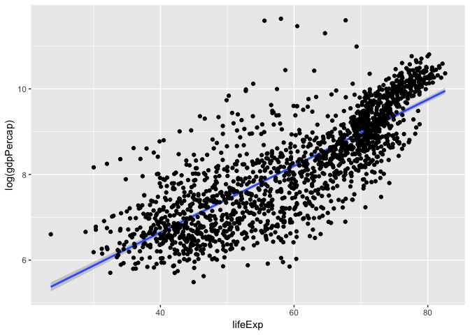
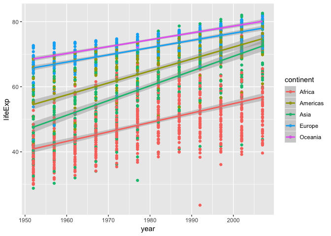
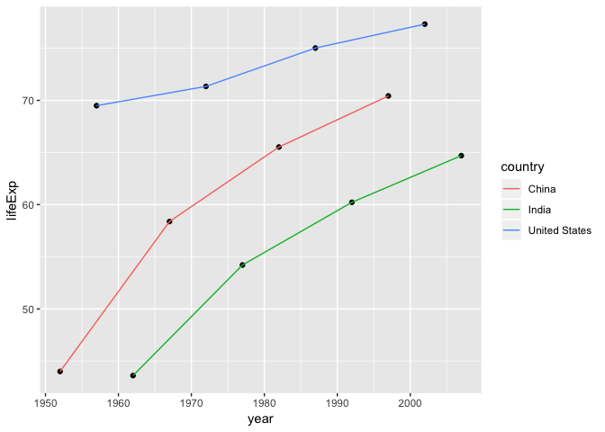

hw02 Explore Gapminder and use dplyr
================

### Smell test the data

``` r
library(gapminder)
library(tidyverse)
```

    ## ── Attaching packages ────────────────────────────────────────────────────── tidyverse 1.2.1 ──

    ## ✔ ggplot2 3.0.0     ✔ purrr   0.2.5
    ## ✔ tibble  1.4.2     ✔ dplyr   0.7.6
    ## ✔ tidyr   0.8.1     ✔ stringr 1.3.1
    ## ✔ readr   1.1.1     ✔ forcats 0.3.0

    ## ── Conflicts ───────────────────────────────────────────────────────── tidyverse_conflicts() ──
    ## ✖ dplyr::filter() masks stats::filter()
    ## ✖ dplyr::lag()    masks stats::lag()

Q: Is it a data.frame, a matrix, a vector, a list? A: gapminder is a data.frame and a list.

``` r
is.data.frame(gapminder)
```

    ## [1] TRUE

``` r
is.matrix(gapminder)
```

    ## [1] FALSE

``` r
is.vector(gapminder)
```

    ## [1] FALSE

``` r
is.list(gapminder)
```

    ## [1] TRUE

Q: What is its class?

``` r
class(gapminder)
```

    ## [1] "tbl_df"     "tbl"        "data.frame"

Q: How many variables/columns?

``` r
ncol(gapminder)
```

    ## [1] 6

Q: How many rows/observations?

``` r
nrow(gapminder)
```

    ## [1] 1704

Q: Can you get these facts about “extent” or “size” in more than one way? Can you imagine different functions being useful in different contexts? A: We can use the `summary`, and `dim` functions to get basic facts about the dataframe:

``` r
summary(gapminder) %>% 
  knitr::kable()
```

|     |     country     |   continent  |     year     |    lifeExp    |        pop        |    gdpPercap    |
|-----|:---------------:|:------------:|:------------:|:-------------:|:-----------------:|:---------------:|
|     | Afghanistan: 12 |  Africa :624 |  Min. :1952  |  Min. :23.60  |  Min. :6.001e+04  |   Min. : 241.2  |
|     |   Albania : 12  | Americas:300 | 1st Qu.:1966 | 1st Qu.:48.20 | 1st Qu.:2.794e+06 | 1st Qu.: 1202.1 |
|     |   Algeria : 12  |   Asia :396  | Median :1980 | Median :60.71 | Median :7.024e+06 | Median : 3531.8 |
|     |   Angola : 12   |  Europe :360 |  Mean :1980  |  Mean :59.47  |  Mean :2.960e+07  |  Mean : 7215.3  |
|     |  Argentina : 12 | Oceania : 24 | 3rd Qu.:1993 | 3rd Qu.:70.85 | 3rd Qu.:1.959e+07 | 3rd Qu.: 9325.5 |
|     |  Australia : 12 |      NA      |  Max. :2007  |  Max. :82.60  |  Max. :1.319e+09  |  Max. :113523.1 |
|     |  (Other) :1632  |      NA      |      NA      |       NA      |         NA        |        NA       |

``` r
dim(gapminder)
```

    ## [1] 1704    6

alternatily, we can also use `ncol` and `nrow` to get the size of the dataframe as I did above.

Q: What data type is each variable?

``` r
sapply(gapminder, class) %>% 
  knitr::kable()
```

|           | x       |
|-----------|:--------|
| country   | factor  |
| continent | factor  |
| year      | integer |
| lifeExp   | numeric |
| pop       | integer |
| gdpPercap | numeric |

### Explore individual variables

##### Explore categorical variable `continent` and quantitative variable `pop`

What are possible values (or range, whichever is appropriate) of each variable?

``` r
unique(gapminder$continent)
```

    ## [1] Asia     Europe   Africa   Americas Oceania 
    ## Levels: Africa Americas Asia Europe Oceania

``` r
range(gapminder$pop)
```

    ## [1]      60011 1318683096

What values are typical? What’s the spread? What’s the distribution? Etc., tailored to the variable at hand.

``` r
summary(gapminder$continent)
```

    ##   Africa Americas     Asia   Europe  Oceania 
    ##      624      300      396      360       24

``` r
summary(gapminder$pop)
```

    ##      Min.   1st Qu.    Median      Mean   3rd Qu.      Max. 
    ## 6.001e+04 2.794e+06 7.024e+06 2.960e+07 1.959e+07 1.319e+09

### Explore various plot types

A scatterplot of two quantitative variables.

``` r
gapminder %>% 
  ggplot(aes(lifeExp, log(gdpPercap))) +
  geom_smooth(method="lm", se=TRUE) + 
  geom_point()
```



A plot of one quantitative variable. Maybe a histogram or densityplot or frequency polygon.

``` r
gapminder %>% 
  ggplot(aes(lifeExp)) +
  geom_histogram(aes(y=..density..), bins=50) + 
  geom_density()
```


A plot of one quantitative variable and one categorical. Maybe boxplots for several continents or countries.

``` r
gapminder %>% 
  filter(continent == c("Africa", "Americas", "Asia")) %>% 
  ggplot(aes(continent, log(pop))) +
  geom_boxplot(bg="green", color="green") +
  geom_violin(alpha=0.1, bg="red", color="red")
```



``` r
gapminder %>% 
  select(year, lifeExp, continent) %>% 
  ggplot(aes(x=year, y=lifeExp, colour=continent)) +
  geom_point() +
  geom_smooth(method="lm", se=FALSE)
```



### But I want to do more!

Q: Evaluate this code and describe the result. Presumably the analyst’s intent was to get the data for Rwanda and Afghanistan. Did they succeed? Why or why not? If not, what is the correct way to do this?

``` r
filter(gapminder, country == c("Rwanda", "Afghanistan")) %>% 
  knitr::kable()
```

| country     | continent |  year|  lifeExp|       pop|  gdpPercap|
|:------------|:----------|-----:|--------:|---------:|----------:|
| Afghanistan | Asia      |  1957|   30.332|   9240934|   820.8530|
| Afghanistan | Asia      |  1967|   34.020|  11537966|   836.1971|
| Afghanistan | Asia      |  1977|   38.438|  14880372|   786.1134|
| Afghanistan | Asia      |  1987|   40.822|  13867957|   852.3959|
| Afghanistan | Asia      |  1997|   41.763|  22227415|   635.3414|
| Afghanistan | Asia      |  2007|   43.828|  31889923|   974.5803|
| Rwanda      | Africa    |  1952|   40.000|   2534927|   493.3239|
| Rwanda      | Africa    |  1962|   43.000|   3051242|   597.4731|
| Rwanda      | Africa    |  1972|   44.600|   3992121|   590.5807|
| Rwanda      | Africa    |  1982|   46.218|   5507565|   881.5706|
| Rwanda      | Africa    |  1992|   23.599|   7290203|   737.0686|
| Rwanda      | Africa    |  2002|   43.413|   7852401|   785.6538|

This result fails to show all of the data for 'Rwanda' and 'Afghanistan'.

``` r
gapminder %>%
  filter(country == "Rwanda" | country == "Afghanistan") %>% 
  knitr::kable()
```

| country     | continent |  year|  lifeExp|       pop|  gdpPercap|
|:------------|:----------|-----:|--------:|---------:|----------:|
| Afghanistan | Asia      |  1952|   28.801|   8425333|   779.4453|
| Afghanistan | Asia      |  1957|   30.332|   9240934|   820.8530|
| Afghanistan | Asia      |  1962|   31.997|  10267083|   853.1007|
| Afghanistan | Asia      |  1967|   34.020|  11537966|   836.1971|
| Afghanistan | Asia      |  1972|   36.088|  13079460|   739.9811|
| Afghanistan | Asia      |  1977|   38.438|  14880372|   786.1134|
| Afghanistan | Asia      |  1982|   39.854|  12881816|   978.0114|
| Afghanistan | Asia      |  1987|   40.822|  13867957|   852.3959|
| Afghanistan | Asia      |  1992|   41.674|  16317921|   649.3414|
| Afghanistan | Asia      |  1997|   41.763|  22227415|   635.3414|
| Afghanistan | Asia      |  2002|   42.129|  25268405|   726.7341|
| Afghanistan | Asia      |  2007|   43.828|  31889923|   974.5803|
| Rwanda      | Africa    |  1952|   40.000|   2534927|   493.3239|
| Rwanda      | Africa    |  1957|   41.500|   2822082|   540.2894|
| Rwanda      | Africa    |  1962|   43.000|   3051242|   597.4731|
| Rwanda      | Africa    |  1967|   44.100|   3451079|   510.9637|
| Rwanda      | Africa    |  1972|   44.600|   3992121|   590.5807|
| Rwanda      | Africa    |  1977|   45.000|   4657072|   670.0806|
| Rwanda      | Africa    |  1982|   46.218|   5507565|   881.5706|
| Rwanda      | Africa    |  1987|   44.020|   6349365|   847.9912|
| Rwanda      | Africa    |  1992|   23.599|   7290203|   737.0686|
| Rwanda      | Africa    |  1997|   36.087|   7212583|   589.9445|
| Rwanda      | Africa    |  2002|   43.413|   7852401|   785.6538|
| Rwanda      | Africa    |  2007|   46.242|   8860588|   863.0885|
